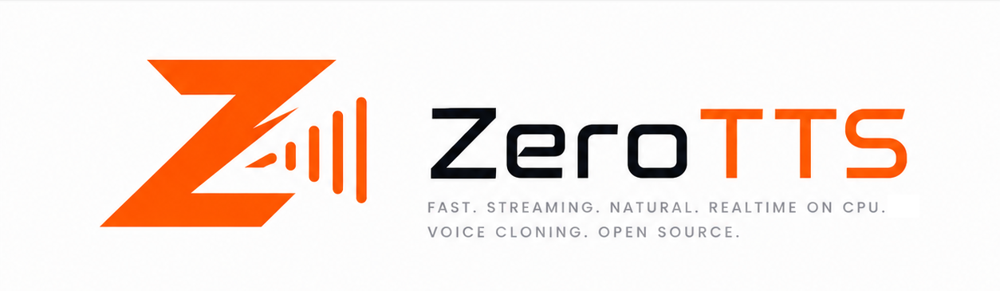

<div align="center">



# ZeroTTS

### Ultra-natural Vietnamese speech, cloned from seconds of audio — streaming, real-time on a CPU

[](https://pypi.org/project/zerotts/)
[](LICENSE)
[](https://onnxruntime.ai/)
[](https://huggingface.co/zeroweight-ai/ZeroTTS)
[](https://huggingface.co/datasets/zeroweight-ai/ZeroBench-TTS)

</div>

**The most accurate open Vietnamese TTS we know of — 13× fewer word errors than
the next open model**, and it runs faster than real time on a laptop CPU.

* 🎯 **Ultra-natural** — 2.91 UTMOS, ~0.5 MOS above every other open Vietnamese
  system, with near-zero dead air (0.029 s vs 0.23–0.53 s).
* 🗣️ **Zero-shot voice cloning** — a voice is a small latent array; drop it in
  and the model speaks in it. No fine-tuning, no per-speaker training.
* ⚡ **Real-time on CPU, streaming** — first audio chunk in ~100 ms, then chunks
  ramp up. No GPU required.
* 🇻🇳 **Built for Vietnamese** — tones, code-switched English, and a built-in
  normalizer that reads `31/12/2025` and `1.250 tỷ` the way a person would.
* 📊 **Measured, not asserted** — every number below comes from
  [ZeroBench-TTS](https://huggingface.co/datasets/zeroweight-ai/ZeroBench-TTS)'s
  own public scorer, on 59 held-out voices.

```python
from zerotts import ZeroTTS

tts = ZeroTTS.from_pretrained("zeroweight-ai/ZeroTTS")
audio = tts.synthesize("Xin chào các bạn, mình là ZeroTTS.", voice="arya")
tts.save_audio(audio, "out.wav")
```

## Contents

1. [Install](#install)
2. [Usage](#usage)
3. [Voices — and voice cloning](#voices--and-voice-cloning)
4. [Benchmarks](#benchmarks)
5. [Web UI](#web-ui)
6. [Browser demo](#browser-demo)
7. [How it works](#how-it-works)
8. [Credits](#credits)

---

## Install

```bash
pip install zerotts
```

That pulls `numpy`, `onnxruntime`, `tokenizers`, `huggingface_hub`, `soundfile`,
`scipy` — and nothing else. Weights download from the Hub on first use
(~900 MB, cached under `HF_HOME`).

Optional extras:

```bash
pip install "zerotts[webui]"   # Gradio demo
pip install "zerotts[eval]"    # benchmark scorers — these DO need torch
```

The `eval` extra is the only thing in this repo that installs PyTorch, and it is
for *measuring* quality, not for generating audio.

## Usage

### Python

```python
from zerotts import ZeroTTS

tts = ZeroTTS.from_pretrained("zeroweight-ai/ZeroTTS")

print(tts.list_voices())

# One shot
audio = tts.synthesize("Hôm nay trời đẹp quá.", voice="arya")
tts.save_audio(audio, "out.wav")

# Streaming — first chunk arrives in ~100 ms, then chunks ramp up in size
for chunk in tts.synthesize_stream("Một đoạn văn bản dài hơn…", voice="arya"):
    play(chunk)   # (1, n) float32 at 48 kHz
```

Dates, clock times, fractions and acronyms are expanded to spoken Vietnamese
before synthesis:

```python
from zerotts import normalize_vi_text

normalize_vi_text("Ngày 23/8/2024 lúc 15h30, giá 1.250.000")
# 'Ngày hai mươi ba tháng tám năm hai nghìn không trăm hai mươi tư lúc
#  mười lăm giờ ba mươi phút, giá một triệu hai trăm năm mươi nghìn'
```

`synthesize()` does **not** apply it — it is a separate step so you stay in
control (the expansions are Vietnamese words, so they are wrong for English
text). The CLI and web UI apply it by default; `zerotts say --no_text_norm`
turns it off.

Long input should be segmented — the model is trained on utterances, not
paragraphs:

```python
from zerotts.chunking import chunk_text, clean_segment_punctuation, normalize_punctuation

segments = [clean_segment_punctuation(s)
            for s in chunk_text(normalize_punctuation(long_text), max_chunk_sec=15)]
```

### Command line

```bash
zerotts voices
zerotts say "Xin chào các bạn." --voice arya -o hello.wav
zerotts say "$(cat article.txt)" --voice arya --chunk -o article.wav
zerotts bench --voice arya
```

### Generation settings

| Argument | Default | Effect |
|---|---|---|
| `voice` | `None` | Voice pack name. `None` = the model's unconditional voice, which is *not* stable across runs. |
| `cfg_scale` | `1.0` | `>1` guides toward the voice's identity, at 2× the per-frame cost. |
| `audio_temperature` | `0.8` | |
| `audio_topk` / `audio_topp` | `25` / `0.95` | |
| `audio_repetition_penalty` | `1.2` | Benchmarked default. `1.0` measurably raises WER and leaves more dead air. |
| `eoa_extra_frames` | `1` | Frames of trailing audio kept after the model signals stop. `0` clips the last phone's release. |

Defaults are the exact settings the [benchmark numbers](#benchmarks) were
produced with, so out-of-the-box output matches the published scores.

## Voices — and voice cloning

A voice in ZeroTTS is a small array of speaker latents, shape
`(1, n_voice_queries, d_model)`. That array is the *entire* speaker
conditioning — there is no reference transcript, no in-context audio prompt, no
teacher-forced frames. It ships as a `.npz` inside the weights repo.

> ### Voice cloning is not available in this release
>
> Those latents are produced by a voice encoder that reads a reference clip, and
> **the voice encoder is not published**. This package can load voices; it cannot
> create them from audio. There is no flag that turns this on.
>
> To get latents for your own speaker, visit
> **[zeroweight.ai](https://zeroweight.ai)** or get in touch.

The boundary is narrower than it sounds: latents obtained that way are just a
`.npz`, so they drop into `voices/<name>/voice.npz` and work with no code change.

```python
tts.list_voices()                       # ['arya', ...]
v = tts.load_voice("arya")
v.emb.shape                             # (1, 10, 768)

# A latent array from anywhere works directly
audio = tts.synthesize("…", voice=my_latents)
```

## Benchmarks

Measured on **[ZeroBench-TTS](https://huggingface.co/datasets/zeroweight-ai/ZeroBench-TTS)** —
137 items, 59 held-out reference voices × 4 subsets — against the two public
Vietnamese XTTS-v2 finetunes. 137/137 scored, 0 empty generations.

**Scored by the benchmark, not by us.** ZeroTTS synthesizes the clips and hands
them to `zerobench_eval`, the official scorer published inside the benchmark
dataset repo. Nothing in this repo computes a metric.

### Headline

Every system reads **normalized text** — dates, numbers and acronyms already
spoken out, from the benchmark's own curated reading. Every system gets exactly
the same input, so the comparison is like-for-like.

This is the condition a Vietnamese TTS system meets in production, where a text
frontend runs ahead of the model. ZeroTTS ships one — `normalize_vi_text`,
applied by default (see [Usage](#usage)) — which reaches the benchmark's reading
on 27 of the 35 items that need normalization; the remaining gaps are date
separators and alphanumeric codes. Neither baseline ships a Vietnamese frontend
at all, which is why the raw-text table below is so much harsher on them.

| | **ZeroTTS** | XTTS-v2-vietnamse | viXTTS |
|---|:-:|:-:|:-:|
| **WER** ↓ | **0.56 %** | 7.27 % | 8.61 % |
| **Naturalness** (UTMOS) ↑ | **2.91** | 2.43 | 2.35 |
| **Voice similarity** (SSIM) ↑ | 0.936 | **0.940** | 0.935 |
| **Dead air** (excess silence) ↓ | **0.029 s** | 0.532 s | 0.233 s |

**13× fewer word errors**, ~0.5 MOS more natural, an order of magnitude less
dead air. Median WER is **0.00 %** on all four subsets — the typical generation
is transcribed exactly.

### WER — normalized text

The headline condition: numbers and dates already spoken out, as the shipped
normalizer produces.

| Subset | what it tests | **ZeroTTS** | XTTS-v2-vietnamse | viXTTS |
|---|---|:-:|:-:|:-:|
| `vietnamese` | monolingual Vietnamese | **0.21 %** | 7.21 % | 7.54 % |
| `code_switch` | Vietnamese + embedded English | **0.95 %** | 10.14 % | 5.86 % |
| `cross_lingual` | foreign voice prompt → Vietnamese | **0.38 %** | 4.94 % | 6.61 % |
| `challenging` | acronyms, dates, %, currency | **0.61 %** | 5.63 % | 13.44 % |
| **overall** | | **0.56 %** | **7.27 %** | **8.61 %** |

### WER — raw text

The harder condition: the model is handed `31/12/2025` and `ChatGPT` verbatim
and has to read them itself, with no normalizer in front. This is what a system
with no Vietnamese text frontend faces.

| Subset | what it tests | **ZeroTTS** | XTTS-v2-vietnamse | viXTTS |
|---|---|:-:|:-:|:-:|
| `vietnamese` | monolingual Vietnamese | **0.16 %** | 7.92 % | 9.56 % |
| `code_switch` | Vietnamese + embedded English | **0.97 %** | 10.94 % | 9.25 % |
| `cross_lingual` | foreign voice prompt → Vietnamese | **1.42 %** | 21.37 % | 27.27 % |
| `challenging` | acronyms, dates, %, currency | **1.75 %** | 27.86 % | 31.85 % |
| **overall** | | **1.03 %** | **16.42 %** | **18.40 %** |

**Reading these fairly:**

* **Normalization is where the baselines gain most, and we still win.** Their
  tokenizers genuinely have no Vietnamese number expansion, so raw text punishes
  them hard (`challenging` 27.86 %) and the normalized column is the fairest
  comparison available — it improves XTTS 2.3× and viXTTS 2.1×, against 1.8× for
  us. The gap narrows from 16× to 13× and stops there, because what remains is
  the acoustic model.
* **`vietnamese` barely moves for anyone** (0.16 % → 0.21 % for ZeroTTS). It has
  no digits or acronyms, so there is nothing to normalize — which is the control
  showing the other subsets' gains are real and not a scoring artifact.
* **Voice similarity is a tie, not a win.** 0.936 / 0.940 / 0.935 is within
  noise. On `cross_lingual` ZeroTTS is genuinely behind (0.911 vs ~0.935): it
  carries a foreign speaker's timbre into Vietnamese slightly less faithfully,
  while winning that subset's WER by 15×.
* **The WER definition matters more than the WER.** ZeroBench scores every clip
  with **two ASRs** (`whisper-large-v3` + `PhoWhisper-large`, min taken — neither
  can judge Vietnamese code-switch TTS alone) against **every acceptable
  reading** of the target text. Its test suite pins the policy in both
  directions: format artifacts must score 0, real defects must still cost.
* **Our remaining errors are published, not hidden.** Every item scoring above
  0.00 is audited in [docs/BENCHMARKS.md](docs/BENCHMARKS.md) — mostly voiced
  leading zeros in dates and `W`/`H` acronym letter names.

Reproduce, or score your own system:

```bash
pip install "zerotts[eval]"
SYNTH_FROM=text_normalized OUT_DIR=./eval/norm ./evaluation/run_benchmark.sh
./evaluation/run_benchmark.sh                                   # raw text
```

Not using ZeroTTS? The scorer stands alone — bring wavs from any system:

```bash
huggingface-cli download zeroweight-ai/ZeroBench-TTS --repo-type dataset --local-dir ZeroBench-TTS
cd ZeroBench-TTS && pip install -r zerobench_eval/requirements.txt
python -m zerobench_eval manifest --out manifest.jsonl    # what to synthesize
python -m zerobench_eval score --wav_dir my_wavs/ --name MyModel
```

## Web UI

```bash
pip install "zerotts[webui]"
python webui/app.py                       # http://localhost:7860
python webui/app.py --model ./local_dir   # a local model directory
```

Voice picker, streaming playback, long-form segmentation, and the generation
settings above.

## Browser demo

[`js/`](js/) runs the same model client-side with `onnxruntime-web` — no server,
no upload. See [docs/BROWSER.md](docs/BROWSER.md).

Note the download: the weights are **fp32 and not quantized**, so the demo fetches
~900 MB once and persists it (OPFS/Cache API). That is a deliberate
quality-over-size choice; it targets desktop broadband, not mobile data.

## How it works

Three ONNX graphs and a two-level autoregressive loop:

| Graph | Runs | Does |
|---|---|---|
| `text_encoder.onnx` | once per utterance | text ids → encoder states |
| `prefix_step.onnx` | once + **once per frame** | advances the global (time) transformer, KV-cached |
| `local_frame_decode.onnx` | **once per frame** | decodes one whole frame: stop-or-continue + all 16 codebooks, with embeddings, CFG mixing and sampling fused in |

Two ONNX Runtime calls per audio frame. Frames come out at 12.5 Hz and are
turned into a 48 kHz waveform by the bundled MOSS codec decoder, either in one
batch or through a KV-cached streaming decoder.

Sampling (temperature / top-k / top-p / repetition penalty) and the stop decision
live *inside* `local_frame_decode.onnx`, not in Python — which is what lets the
identical pipeline run under `onnxruntime-web`, where there is no Python at all.

More detail — tensor shapes, the KV-cache contract, the position-id convention —
in [docs/RUNTIME.md](docs/RUNTIME.md).

**Not included:** model architecture, training code, and the ONNX export script
are not part of this repository, and the voice encoder is not published (see
[Voices](#voices--and-voice-cloning)).

## Credits

Speech codec: **[MOSS-Audio-Tokenizer-Nano](https://github.com/OpenMOSS/MOSS-Audio-Tokenizer)**
by the OpenMOSS team, Apache-2.0. ZeroTTS bundles its ONNX **decoder** graphs in
the weights repo so there is no external runtime dependency; see
[NOTICE](NOTICE) and [LICENSES/](LICENSES/).

```bibtex
@misc{gong2026mossaudiotokenizerscalingaudiotokenizers,
  title={MOSS-Audio-Tokenizer: Scaling Audio Tokenizers for Future Audio Foundation Models},
  author={Yitian Gong and Kuangwei Chen and Zhaoye Fei and Xiaogui Yang and Ke Chen
          and Yang Wang and Kexin Huang and Mingshu Chen and Ruixiao Li
          and Qingyuan Cheng and Shimin Li and Xipeng Qiu},
  year={2026}, eprint={2602.10934}, archivePrefix={arXiv}, primaryClass={cs.SD}
}
```

Vietnamese text normalization adapts the expansion rules and abbreviation table
of **[soe-vinorm](https://github.com/vinhdq842/soe-vinorm)** (MIT), reimplemented
as pure stdlib regex so the inference path keeps its no-torch, no-download
guarantee. See [NOTICE](NOTICE).

Benchmark reference audio comes from
[VIVOS](https://huggingface.co/datasets/AILAB-VNUHCM/vivos),
[viVoice](https://huggingface.co/datasets/capleaf/viVoice),
[phoaudiobook](https://huggingface.co/datasets/thivux/phoaudiobook) and
[Emilia](https://huggingface.co/datasets/amphion/Emilia-Dataset).
ASR scoring uses [PhoWhisper](https://huggingface.co/vinai/PhoWhisper-large) (VinAI).

## License

Code and weights: **MIT**. The bundled MOSS codec decoder is Apache-2.0.
The ZeroBench-TTS *dataset* is CC-BY-NC-4.0 (it redistributes audio from the
corpora above) — that applies to the benchmark, not to ZeroTTS.
